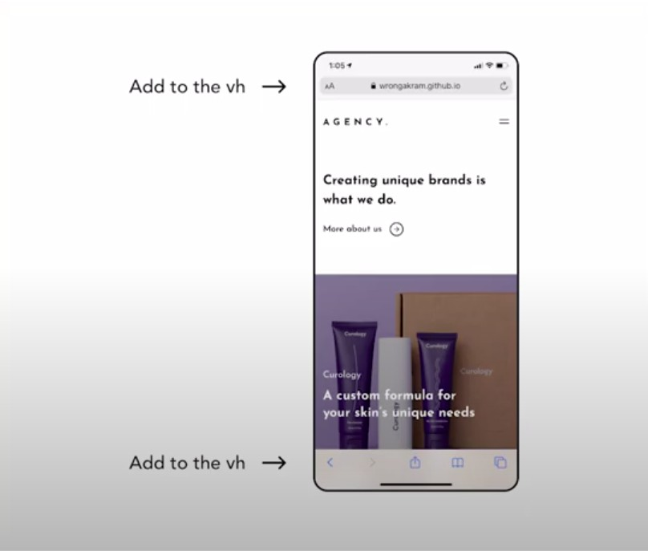

<div style="margin: 0 auto; width:70%; text-align:center;">

<h1 style="width:80%; text-decoration:underline; text-align:center;">AWWWWWARDS inspired website</h1>
<h5 style="width:80%; text-decoration:underline; text-align:center;">made by Wrong Akram</h5>

<br>
<br>
<br>
<br>

<p>I wanted to give this tutorial a try from the moment i saw this way
of applying media queries, as until now i have been using a very generic manner
of handling it.</p>

<br>
<br>

#### NEW STUFF I learned 1 ) \_

```javascript
// ----------
// This is connected to the breakpoints.scss
// ----------
//
//
$breakpoints: (
  "phone": 425px, //     *************
  "tablet": 768px,
  "desktop": 1366px,
  "LGdesktop": 1920px,
) !default;

/*
You are not forced to use the breakpoints above, you can also
add CUSTOM like so:

 @include media("<=300px") {
      width: etc
    }

*/

// ----------
// header.scss
// ----------
header {
  position: fixed;
  width: 100%;
  height: 128px;
  z-index: 4;
  @include media("<=phone") { //  *************
    height: 96px;
  }
  background-color: rgb(250, 217, 203);
  .logo {
    a {
        //the font-family are inside the App.scss body: html {
      // using rem , which are relative to the html font-sizes which is equivalent to 16px
      //https://www.ninjaunits.com/converters/pixels/rem-pixels/

      font-size: 1.2rem;
      letter-spacing: 0.05rem;
      text-decoration: none;
      font-weight: 700;
    }
  }
```

<br>
<br>

#### NEW STUFF I learned 2) \_

##### SVG issue and solution

<br>

```javascript
// ----------
// banner.js
// ----------
<a href="/">
  More about us 
</a>

/*
                                The ISSUE **

    The problem with the following:

     <a href="/">More about us 

                 is that you dont have styling capabilities in terms
                 of hover effects or anything that you want to change
                 in svg styles


                 THE SOLUTION **

// to do the following you have to have the image in the assets folder

     import { ReactComponent as RightArrow } from "../assets/arrow-right.svg";

//THEN add the component inside the a tag like so:
*/
            <a href="/">
              More about us
              <RightArrow />
            </a>
```

<br>
<br>
<br>
<br>

<p>So even if understand many of the things you can find in the file breakpoint.scss and App.scss
, I know that this tutorial is going to be a challenge.</p>

<br>

##### :baby: REMEMBER TO ASK about:

#### 1

```javascript
// ----------
// Remember to ask your teachers about the following (note for myself)
// ----------
//
//
$media-expressions: (
  "screen": "screen",
  "print": "print",  //?????
  "handheld": "handheld",
  "retina2x": (  //?????
    "(-webkit-min-device-pixel-ratio: 2)",
    "(min-resolution: 192dpi)"
  ),
  "retina3x": (  //?????
    "(-webkit-min-device-pixel-ratio: 3)",
    "(min-resolution: 350dpi)"
  )
) !default;
```

<br>
<br>
<br>

##### :baby: REMEMBER TO ASK about:

#### 2

<br>

<p >He explained that in this device "mobile"
you have to be careful when adding a vh , because in some mobiles you have 
the bar on the top and bottom where you find the browser functionalities such as
: where you search for the  URL of another website for example, i will add the
screenshot he provided.</p>

<br>
<br>



<br>
<br>

<h5 >

So to solve that issue you have to use a calculation to capture the inner height
of the window so to adapt those 50vh depending of the size of the window.</h5>

```javascript
// ----------
//banner.scss
// ----------
//
//
.main {
  height: 50vh; //fallback option, serves in the case a certain
  //   browser doesn't support the next line with THE CALCULATION in the height


  height: calc(var(--vh, 1vh) * 50);
//   --vh is the variable you will use in the "App.js" as you have to set it up also there
//
//

//
//
//
// ----------
// App.js
// ----------
//
//
import React, { useEffect } from "react";
//for the change of the --vh in the banner 50vh


function App() {
  useEffect(() => {
    // let vh be the window.innerHeight , multiplied by .01
    let vh = window.innerHeight * 0.01;
    document.documentElement.style.setProperty("--vh", `${vh}px`);
  }, []);

  return (
    <div className="App">
```

<br>
<br>

<h5>so the line above once you set it up in the App.js with the useEffect 
and stuff for the changes, WILL NOW MAKE ROOM for the HEIGHT of the bars 
that are on TOP
and BOTTOM of the dependent browser that we are using whether thats Chrome 
or Safari or Firefox on your mobile browser</h5>

<br>
<br>

```javascript
 height: calc(var(--vh, 1vh) * 50);
```

</div>
